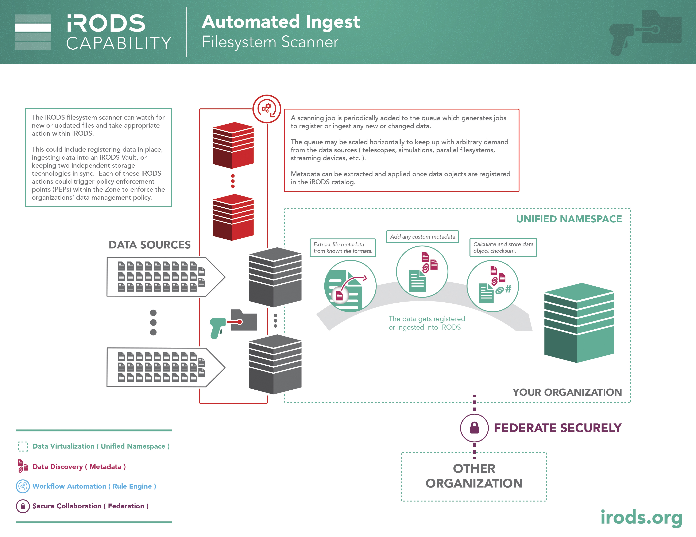
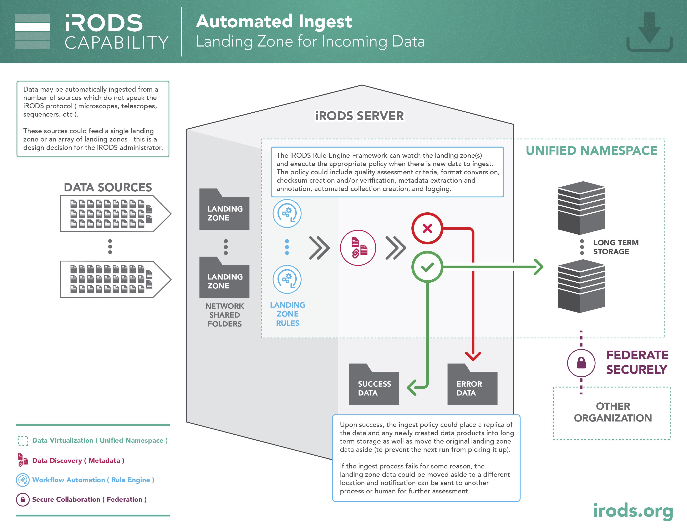

# iRODS Automated Ingest Framework

The automated ingest framework gives iRODS an enterprise solution that solves two major use cases: getting existing data under management and ingesting incoming data hitting a landing zone.

Based on the Python iRODS Client and Celery, this framework can scale up to match the demands of data coming off instruments, satellites, or parallel filesystems.

The example diagrams below show a filesystem scanner and a landing zone.





## Quick Start

### Configure `python-irodsclient` environment

`python-irodsclient` (PRC) is used by the Automated Ingest tool to interact with iRODS. The configuration and client environment files used for a PRC application apply here as well.

More information about configuring the iRODS client environment can be found in [Configuring iRODS and `python-irodsclient` (PRC)](#configuring-irods-and-python-irodsclient-prc).

### Starting Redis Server

Install Redis server: [https://redis.io/docs/latest/get-started](https://redis.io/docs/latest/get-started)

Starting the Redis server with package installation:
```
redis-server
```
Or, dameonized:
```
sudo service redis-server start
```
```
sudo systemctl start redis
```

The Redis GitHub page also describes how to build and run Redis: [https://github.com/redis/redis?tab=readme-ov-file#running-redis](https://github.com/redis/redis?tab=readme-ov-file#running-redis)

### Setting up virtual environment

You may need to upgrade pip:
```
pip install --upgrade pip
```

Install virtualenv:
```
pip install virtualenv
```

Create a virtualenv with python3:
```
python -m venv rodssync
```

Activate virtual environment:
```
source rodssync/bin/activate
```

### Install this package
```
pip install irods_capability_automated_ingest
```

Set up environment for Celery:
```
export CELERY_BROKER_URL=redis://<redis_host>:<redis_port>/<redis_db> # e.g. redis://127.0.0.1:6379/0
export PYTHONPATH=`pwd`
```

Start celery worker(s):
```
celery -A irods_capability_automated_ingest worker -l error -Q restart,path,file -c <num_workers>
```
**Note:** Make sure queue names match those of the ingest job (default queue names shown here).

### Using the sync script

#### Start sync job
```
python -m irods_capability_automated_ingest.irods_sync start <source_dir> <destination_collection>
```

#### List jobs
```
python -m irods_capability_automated_ingest.irods_sync list
```

#### Stop jobs
```
python -m irods_capability_automated_ingest.irods_sync stop <job_name>
```

#### Watch jobs (same as using `--progress`)
```
python -m irods_capability_automated_ingest.irods_sync watch <job_name>
```

## System Overview

### Celery tasks

The Celery application for the Automated Ingest framework handles a few different Celery tasks. The Celery tasks are affiliated with a main task which is enqueued by the `irods_sync` script. The main task is also called the overall sync "job".

### Celery queues

There are 3 Celery queues used by the Automated Ingest framework: `restart`, `path`, and `file`.

The `restart` queue is for the main task which enqueues the first `path` sync task. This is the initial task enqueued by the `irods_sync` script. It is called the `restart` queue because the `restart` task can be restarted if it is run periodically.

The `path` queue is used for the task which iterates over the entries in the source storage. For each entry in the source storage system, other asynchronous tasks are enqueued to sync the data to iRODS. In the case of a filesystem, recursively syncing a sub-directory involves enqueueing a separate, asynchronous task on the `path` queue. For individual files or objects, tasks are composed of syncing a number of files controlled by the `--files_per_task` option.

The `file` queue is used for tasks which sync data and directories (where applicable) from the source storage. The tasks in this queue involve syncing data from a number of files or objects controlled by the `--files_per_task` option.

The Celery queue names can be adjusted with some options available to the `irods_sync` script. This is useful if you want to use the same Redis database for multiple simultaneous sync jobs. For instance, if you have Celery workers dedicated to different parts of your infrastructure, the tasks for each system could be separated by giving them unique names and having the different Celery workers watching the queues for the system for which they are responsible.

### Celery message broker

The Automated Ingest framework uses Redis as a message broker, leveraging `redis-py` (see [https://pypi.org/project/redis](https://pypi.org/project/redis)). The message broker is used to coordinate Celery workers and store the task queues.

### Automated Ingest and Redis

In addition to acting as the message broker for Celery, the Redis database is used by the Automated Ingest framework as a cache of information about previously synced paths. This offers the advantage of being able to sync the same path repeatedly while only needing to do work (e.g. contact iRODS) for paths which have changed.

The Automated Ingest framework also uses Redis to store any custom event handlers which are fetched by the Celery workers to customize behavior. This is useful because the custom event handler files do not need to exist on every Celery worker node - just the host running the `irods_sync` script.

### `irods_sync`

The `irods_capability_automated_ingest.irods_sync` script is used to manage sync jobs. The script has 4 subcommands: `start`, `stop`, `list`, and `watch`. This script does not need to be run on the same host as the Celery workers and can be used as the "starting point" for users wishing to schedule sync jobs.

### Event Handler file

The Event Handler file is a Python file that is imported as a module by Celery workers and used to modify and extend the behavior provided by the Automated Ingest framework. The contents of the Python file are stored in Redis so that the file needs only to exist locally to the `irods_sync` script rather than on every host on which Celery workers are running. Most supported event handler methods have example implementations in the `irods_capability_automated_ingest/examples` directory. More information about the methods which can be implemented in an Event Handler file can be found in [Event Handler behavioral overrides](#event-handler-behavioral-overrides) and [Event Handlers](#event-handlers).

### `meta` dict

Almost all of the Celery tasks, internal functions, and event handler methods take a parameter called `meta`. `meta` is a Python `dict` which holds the context surrounding an ingest job as well as information for specific tasks. While `meta` holds a lot of different information that is useful at various times, there are a few very important keys which would be good to note.

#### `root`

The `root` key maps to the path in the source storage that is being synced. Let's say that the `irods_sync` script being run had the following options:
```
python3 -m irods_capability_automated_ingest.irods_sync start \
    /source/data /tempZone/home/rods/data
```

The value of `meta["root"]` would be "/source/data". This value does not change for the duration of the overall sync job or in any constituent task.

#### `path`

The `path` key maps to the current path on the source storage which is being synced. The value changes in different tasks depending on what is being synced. For most cases, `path` values will always be a subdirectory or file under the path to which `root` is mapped.

If a file is being synced from a filesystem, the `path` key maps to the path of that file. If a directory is being synced from a filesystem, the `path` key maps to the path of that directory.

Let's say that the `irods_sync` script being run had the following options:
```
python3 -m irods_capability_automated_ingest.irods_sync start \
    /source/data /tempZone/home/rods/data
```
If a file at the path `/source/data/subdir/file1` is being synced, `/source/data/subdir/file1` would be the value of `path`.

If a path being synced requires modification due to a `character_map` Event Handler method or cannot be represented due to a `UnicodeEncodeError`, `path` will be updated accordingly.

#### `target`

The `target` key maps to the current logical path in iRODS to which data is being synced. The value changes in different tasks depending on what is being synced.

If a file is being synced from a filesystem, the `target` key maps to the logical path of the data object to which the data is being synced. If a directory is being synced from a filesystem, the `target` key maps to the logical path of the collection to which the data is being synced.

The iRODS logical path used as a value for `target` is constructed based on the path of the source storage being synced. Let's say that the `irods_sync` script being run had the following options:
```
python3 -m irods_capability_automated_ingest.irods_sync start \
    /source/data /tempZone/home/rods/data
```
If a file at the path `/source/data/subdir/file1` is being synced (note: this would be the value of `path` at this point), `/tempZone/home/rods/data/subdir/file1` would be the value for `target`.

#### `job_name`

The `job_name` key maps to the name of the overall sync job to which the current task being executed belongs. This can be useful for fetching information about the sync job from the Redis database, or for annotating metadata regarding the sync job to data objects or collections.

#### `restart_queue`, `path_queue`, and `file_queue`

The `restart_queue`, `path_queue`, and `file_queue` keys map to the queue names for the `restart`, `path`, and `file` queues.

#### `config`

The `config` key maps to another Python `dict` which holds configuration information about the sync job. There are 3 keys in this dict.

The `log` key configures the Python logger used by Celery workers. See [`sync_logger`](#sync_logger) below for more information about the `log` configuration.

The `profile` key configures information for the `profile` feature. Its value is a `dict` similar to the `log` configuration whose keys correspond to the `--profile_filename`, `--profile_when`, `--profile_interval`, and `--profile_level` options of the `irods_sync` script. See [Profiling options](#profiling-options) for more information.

The `redis` key configures communication with the Redis database. Its value is a `dict` that looks like this:
```javascript
{
    // ... Other stuff ...

    "config": {
        // ... Other stuff ...

        "redis": {
            "host": "<string>",
            "port": <int>,
            "db": <int>
        }

        // ... Other stuff ...
    }

    // ... Other stuff ...
}
```
The `host`, `port`, and `db` correspond to the `--redis_host`, `--redis_port`, and `--redis_db` options for the `irods_sync` script. See [Redis configuration options](#redis-configuration-options) for more information.

### `sync_logger`

The `sync_logger` is the logger used by the Celery workers while executing tasks. The client submitting a job (e.g. the `irods_sync` script) configures the logger in `meta`. This is what the configuration looks like in `meta`:
```javascript
{
    // ... Other stuff ...

    "config": {
        // ... Other stuff ...

        "log": {
            "filename": "<string>" or None,
            "log_when": "<string>" or None,
            "interval": "<string>" or None,
            "level": "<string>" or None
        }

        // ... Other stuff ...
    }

    // ... Other stuff ...
}
```
Each member of the `dict` corresponds with the [Logging Options](#logging-options) described below.

To instantiate the `sync_logger` for use, do something like this:
```python
# Get the "config" from meta...
config = meta["config"]
# Get the "log" from the config...
log_config = config.get("log")
# Get the sync_logger based on the log_config.
logger = sync_logging.get_sync_logger(log_config)
```
The returned logger can then be used to log messages in a standard way. Note: This should only be done inside a Celery task or Event Handler method.

## `irods_sync start`

`irods_sync start` is used to start a sync job by enqueueing the main task of the overall sync job. The main task is run asynchronously by default, but can be run synchronously with the `--synchronous` option.

This subcommand has 2 required positional arguments: a source path and a destination path.

The source path must point to a path for a supported storage type. Right now, filesystems (e.g. UNIX, Windows, etc.) and S3 buckets are supported.

The destination path must point to an iRODS collection. The root collection (`/`) cannot be used as the destination collection.

### Celery task options

These options are used to control various aspects of the sync job and resultant individual Celery tasks.

In this section, wherever a word with all uppercase letters follows an option name, it is meant to signify a placeholder for a value meant to accompany the option. For example, if the option name is `--option`, `--option VALUE` means that `VALUE` is the placeholder for the value to be provided.

#### `--job_name`

`--job_name JOB_NAME` will use the name `JOB_NAME` as the reference name for the overall sync job which is used to track individual tasks spawned from the main task. The default name for the sync job is a generated UUID.

#### `--restart_queue`

`--restart_queue RESTART_QUEUE_NAME` will use the name `RESTART_QUEUE_NAME` for the `restart` queue. The default name for the `restart` queue is "restart". Remember: The `restart` queue is where the task for the main sync job is enqueued.

#### `--path_queue`

`--path_queue PATH_QUEUE_NAME` will use the name `PATH_QUEUE_NAME` for the `path` queue. The default name for the `path` queue is "path".

#### `--file_queue`

`--file_queue FILE_QUEUE_NAME` will use the name `FILE_QUEUE_NAME` for the `file` queue. The default name for the `file` queue is "file".

#### `--interval`

`--interval INTERVAL_IN_SECONDS` will enqueue - or, "restart" - the main task of the sync job repeatedly with an interval of `INTERVAL_IN_SECONDS` seconds. If absent, the sync job will only be run once. To stop a recurring job, `irods_sync stop JOB_NAME` can be used on the job specified by `JOB_NAME`. Note: Scheduling sync jobs using a dedicated job scheduling tool such as `cron` has been shown to be very effective as an alternative to this option. Consider using an external tool for scheduling regularly occurring sync jobs.

#### `--ignore_cache`

`--ignore_cache` will ignore the cache maintained in Redis by the Automated Ingest framework. The sync tasks will not consult the Redis cache to "sync" data but rather will treat all data as new, even if it is not. This is useful if you wish to scan a source after having already scanned it but need to sync the data to the same destination again. Notice that this option will not work with certain `Operation` types (e.g. `PUT`).

#### `--event_handler`

`--event_handler /path/to/event_handler.py` will use the specified `/path/to/event_handler.py` Python file as a custom event handler to modify the default behavior of the Automated Ingest framework as well as allow for other custom behavior to be implemented. The event handler methods are detailed below in [Event Handler behavioral overrides](#event-handler-behavioral-overrides) and [Event Handlers](#event-handlers).

### Script options

These options are used to control various aspects of the `irods_sync` script itself.

#### `--synchronous`

`--synchronous` specifies that the `irods_sync` script should not exit until the scheduled sync job is complete. By default, the `irods_sync` script will exit as soon as the main sync job Celery task has been enqueued.

#### `--progress`

`--progress` specifies that a progress bar and Celery task counts associated with the enqueued sync job should be shown. This option requires the `--synchronous` option in order to have any effect.

### Optimization options

These options are used for optimizing job completion for speed and resilience.

#### `--files_per_task`

`--files_per_task NUMBER_OF_FILES_PER_TASK` will use `NUMBER_OF_FILES_PER_TASK` as the number of files to sync in a given Celery task. A value of 1 means that 1 Celery task will be enqueued for every file or object that is synced. This number must be a positive integer. The default value is **50** files per task due to experiments which found that this number of files per task optimally balances the amount of work required of a worker by each task against the overhead of completing the task and fetching a new one from the queue. Your results may vary, so adjust the value based on your own use case.

#### `--initial_ingest`

`--initial_ingest` specifies that the destination iRODS path to which data is being synced does not need to be checked before syncing the data. Use this option on the first time a sync occurs to a new destination iRODS path to avoid the unnecessary calls to the iRODS API. By default, the destination iRODS path is checked to ensure that it does not already exist in order to avoid unnecessary syncs or syncs which would result in errors (e.g. a `PUT` operation to an existing path will not overwrite the data - it will produce an error).

#### `--irods_idle_disconnect_seconds`

`--irods_idle_disconnect_seconds SECONDS_BEFORE_IDLE_DISCONNECT` will disconnect an iRODS session after `SECONDS_BEFORE_IDLE_DISCONNECT` seconds of being idle. This is useful for refreshing iRODS connections in the pool maintained by the Automated Ingest framework. The default value is **60** seconds.

### Selective syncing options

These options are used to filter out certain files and directories from being synced to iRODS. These are useful if a type of file or name of a directory / file is unwanted in iRODS for whatever reason.

#### `--exclude_file_type`

`--exclude_file_type FILE_TYPE` will exclude any file detected as being of type `FILE_TYPE`. `FILE_TYPE` must be one of the following strings:

 - regular: This excludes all files which are not one of the rest of the list of supported file types.
 - directory: This excludes any directories found in the source path. Note: This will exclude any subdirectories of the source filesystem, effectively making the sync non-recursive.
 - character: This excludes any character device files. See [Character Special File documentation](https://pubs.opengroup.org/onlinepubs/9699919799/basedefs/V1_chap03.html#tag_03_91) for more information.
 - block: This excludes any block device files. See [Block Special File documentation](https://pubs.opengroup.org/onlinepubs/9699919799/basedefs/V1_chap03.html#tag_03_79) for more information.
 - socket: This excludes any socket files. See [Socket documentation](https://pubs.opengroup.org/onlinepubs/9699919799/basedefs/V1_chap03.html#tag_03_356) for more information.
 - pipe: This excludes any named pipe files (FIFOs). See [FIFO Special File documentation](https://pubs.opengroup.org/onlinepubs/9699919799/basedefs/V1_chap03.html#tag_03_163) for more information.
 - link: This excludes any symbolic links. See [Symbolic Links documentation](https://pubs.opengroup.org/onlinepubs/9699919799/basedefs/V1_chap03.html#tag_03_381) for more information.

The way the Automated Ingest framework tests for these types of files follows the process described here: [Testing the Type of a File](https://www.gnu.org/software/libc/manual/html_node/Testing-File-Type.html)

The default behavior is to include all types of files; or, put another way, the default behavior is to exclude no file types. This option is only valid for filesystem syncs.

#### `--exclude_file_name`

`--exclude_file_name EXCLUDE_FILES_MATCHING_REGEX` will exclude any file whose path matches the regular expression specified by `EXCLUDE_FILES_MATCHING_REGEX`. See the [Python Regular Expression Syntax documentation](https://docs.python.org/3/library/re.html#regular-expression-syntax) for more information.

#### `--exclude_directory_name`

`--exclude_directory_name EXCLUDE_DIRECTORIES_MATCHING_REGEX` will exclude any directory whose path matches the regular expression specified by `EXCLUDE_DIRECTORIES_MATCHING_REGEX`. See the [Python Regular Expression Syntax documentation](https://docs.python.org/3/library/re.html#regular-expression-syntax) for more information. Note: This will exclude syncing the directory and any of its files and subdirectories. This option is only valid for filesystem syncs.

### Redis configuration options

These options can be used in lieu of the `CELERY_BROKER_URL` environment variable to point the `irods_sync` script at a particular Redis instance.

#### `--redis_host`

`--redis_host REDIS_HOSTNAME` will use `REDIS_HOSTNAME` as the hostname for the Redis database with which the `irods_sync` script will communicate to submit the main task for the sync job. The default `REDIS_HOSTNAME` used in the absence of any other input is `localhost`.

#### `--redis_port`

`--redis_port REDIS_PORT` will use `REDIS_PORT` as the port number on which the Redis database is listening for incoming requests. The default `REDIS_PORT` used in the absence of any other input is 6379, which is the official default Redis port number.

#### `--redis_db`

`--redis_db REDIS_DB` will use `REDIS_DB` as the database number to which the `irods_sync` tasks will be submitted. The default `REDIS_DB` used in the absence of any other input is 0, which is the official default Redis database number.

### S3 options

These options are used to specify that `irods_sync` is using an S3 bucket as a source. In order to sync an S3 bucket, the `--s3_keypair` option and a source path of the form `/bucket_name/path/to/root/folder` are the minimum requirements.

#### `--s3_keypair`

`--s3_keypair /path/to/s3_keypair` will use `/path/to/s3_keypair` to authenticate with the S3 endpoint where the source bucket exists. There is no default value for this option and it *must* be specified when syncing an S3 bucket. The keypair file must exist on a filesystem accessible from the host running the `irods_sync` script and should have exactly the following form:
```
ACCESS_KEY
SECRET_KEY
```
`ACCESS_KEY` should be the S3 access key (sometimes this is used as a username). `SECRET_KEY` should be the S3 secret key (sometimes this is used as a password).

#### `--s3_endpoint_domain`

`--s3_endpoint_domain S3_ENDPOINT_DOMAIN` will use `S3_ENDPOINT_DOMAIN` as the domain name of the S3 endpoint. The default value is "s3.amazonaws.com", which would indicate an AWS bucket.

#### `--s3_region_name`

`--s3_region_name S3_REGION_NAME` will use `S3_REGION_NAME` as the region name for the S3 endpoint. The default value is "us-east-1".

#### `--s3_proxy_url`

`--s3_proxy_url S3_PROXY_URL` will use `S3_PROXY_URL` as the URL for a proxy host for S3 access. This could be useful if your organization requires S3 access through a centralized location.

#### `--s3_insecure_connection`

`--s3_insecure_connection` specifies that SSL should not be used when connecting to the S3 endpoint. The default value is `False`, which means that SSL is used for S3 endpoint communications when this option is *not* specified. **This option is not recommended for use in production deployments.**

### Logging options

#### `--log_level`

`--log_level LOG_LEVEL` specifies that only messages of level `LOG_LEVEL` or higher should be logged by the `irods_sync` script. `LOG_LEVEL` must be one of the following string values (listed in ascending order):

 - NOTSET
 - DEBUG
 - INFO
 - WARNING
 - ERROR
 - CRITICAL

By default, only messages of level `WARNING` or higher will be logged.

Celery worker log messages are not affected by this option. To specify a log level for the Celery workers, the `--loglevel` option should be used when running the `worker`. See [Celery documentation](https://docs.celeryq.dev/en/stable/reference/cli.html#cmdoption-celery-worker-l) for more information.

#### `--log_filename`

`--log_filename /path/to/log_file.txt` will use `/path/to/log_file.txt` as the destination for log messages emitted by the `irods_sync` script. The default value is `None`, which means that log messages go to `stdout` by default.

Celery worker log messages are not affected by this option. To specify a log file for the Celery workers, the `--logfile` option should be used when running the `worker`. See [Celery documentation](https://docs.celeryq.dev/en/stable/reference/cli.html#cmdoption-celery-worker-f) for more information.

#### `--log_when`

`--log_when WHEN` will use `WHEN` as the value passed to the `when` parameter of the `TimedRotatingFileHandler` used for managing log files. See [Python `TimedRotatingFileHandler` documentation](https://docs.python.org/3/library/logging.handlers.html#logging.handlers.TimedRotatingFileHandler) for more information. This option only has an effect if `--log_filename` is used.

#### `--log_interval`

`--log_interval INTERVAL` will use `INTERVAL` as the value passed to the `interval` parameter of the `TimedRotatingFileHandler` used for managing log files. See [Python `TimedRotatingFileHandler` documentation](https://docs.python.org/3/library/logging.handlers.html#logging.handlers.TimedRotatingFileHandler) for more information. This option only has an effect if `--log_when` is used. The default value is **1**.

### Profiling options

`--profile` allows you to use vis to visualize a profile of Celery workers over time of ingest job.

| option | effect | default |
| ----   |  ----- |  ----- |
| profile_filename | Specify name of profile filename (JSON output) | None |
| profile_level | Minimum level of message to log for profiling | None |
| profile_interval | Time interval with which to rollover ingest profile file | None |
| profile_when | Type/units of profile_interval (see TimedRotatingFileHandler) | None |

## Event Handler behavioral overrides

The contents of the Event Handler Python file are stored in Redis so that the file needs only to exist locally to the `irods_sync` script rather than on every host on which Celery workers are running. Event handler implementation examples can be found [in the examples directory](irods_capability_automated_ingest/examples).

Event handler methods can use `logger` to write logs. See `structlog` for available logging methods and signatures.

This section details methods which override default behaviors of the Automated Ingest framework such as retry logic and target resources for replicas. The methods for the actual Event Handlers is detailed in the [Event Handlers](#event-handlers) section.

### `character_map`

If an application should require that iRODS logical paths produced by the ingest process exclude subsets of the
range of possible Unicode characters, we can add a character\_map method that returns a dict object. For example:

```python
from irods_capability_automated_ingest.core import Core
class event_handler(Core):
    @staticmethod
    def character_map():
        return {
            re.compile('[^a-zA-Z0-9]'):'_'
        }
    # ...
```
The returned dictionary, in this case, indicates that the ingest process should replace all non-alphanumeric (as
well as non-ASCII) characters with an underscore wherever they may occur in an otherwise normally generated logical path.
The substition process also applies to the intermediate (ie collection name) elements in a logical path, and a suffix is
appended to affected path elements to avoid potential collisions with other remapped object names.

Each key of the returned dictionary indicates a character or set of characters needing substitution.
Possible key types include:

   1. character
   ```
       # substitute backslashes with underscores
       '\\': '_'
   ```
   2. tuple of characters
   ```
       # any character of the tuple is replaced by a Unicode small script x
       ('\\','#','-'): '\u2093'
   ```
   3. regular expression
   ```
       # any character outside of range 0-256 becomes an underscore
       re.compile('[\u0100-\U0010ffff]'): '_'
   ```
   4. callable accepting a character argument and returning a boolean
   ```
       # ASCII codes above 'z' become ':'
       (lambda c: ord(c) in range(ord('z')+1,128)): ':'
   ```

In the event that the order-of-substitution is significant, the method may instead return a list of key-value tuples.

#### UnicodeEncodeError handling

Any file whose path in the filesystem whose ingest results in a UnicodeEncodeError exception being raised (e.g. by the
inclusion of an unencodable UTF8 sequence) will be automatically renamed using a base-64 sequence to represent the original,
unmodified vault path.

Additionally, data objects that have had their names remapped, whether pro forma or via a UnicodeEncodeError, will be
annotated with an AVU of the form

   Attribute:	"irods::automated_ingest::" + ANNOTATION_REASON
   Value:	A PREFIX plus the base64-converted "bad filepath"
   Units:	"python3.base64.b64encode(full_path_of_source_file)"

Where :
   - ANNOTATION_REASON is either "UnicodeEncodeError" or "character\_map" depending on why the remapping occurred.
   - PREFIX is either "irods_UnicodeEncodeError\_" or blank(""), again depending on the re-mapping cause.

Note that the UnicodeEncodeError type of remapping is unconditional, whereas the character remapping is contingent on
an event handler's character_map method being defined.  Also, if a UnicodeEncodeError-style ingest is performed on a
given object, this precludes character mapping being done for the object.

### `as_user`

This method should return a pair of strings specifying the zone and the name of the user on behalf of whom the sync will be peformed. In other words, the Automated Ingest framework will act as a proxy for this user and all data syncing will be done as the `as_user` user. Here is what the method should look like:
```python
from irods_capability_automated_ingest.core import Core
class event_handler(Core):
    @staticmethod
    def as_user(meta, **options):
        # Replace "zone_name" with the user's zone name and "user_name" with the user's username.
        return "zone_name", "user_name"
```
The default behavior performs the sync tasks as the user authenticated in the client environment of the Celery workers.

### `target_path`

This method should return a string specifying the physical path of the data that should be registered for registration operations. This allows specifying a mount path on the iRODS server which can be different from the mount path being used on the client (i.e. the Celery worker nodes) when registering data on the same networked filesystem. This is used directly as the physical path to register in iRODS, so the path needs to be accessible by the iRODS server where the registration is occurring and must be an absolute path to the file being registered. Here is what the method should look like:
```python
from irods_capability_automated_ingest.core import Core
class event_handler(Core):
    @staticmethod
    def target_path(session, meta, **options):
        # Manipulate path such that the base directory uses the desired mountpoint name.
        path = meta["path"]
        return path
```
The default behavior is to use the path handed to it.

### `to_resource`

This method returns a string specifying a target resource to which data will be synced. This must refer to a root resource because iRODS does not allow directly accessing child resources. Here is what the method should look like:
```python
from irods_capability_automated_ingest.core import Core
class event_handler(Core):
    @staticmethod
    def to_resource(session, meta, **options):
        # Replace "resource_name" with the name of the resource to which data will be synced.
        return "resource_name"
```
The default behavior is to use the default resource specified in the client environment. If no default resource is specified, resource selection is deferred to the server.

Note: This event handler method is required when using `REGISTER_AS_REPLICA_SYNC`.

### `max_retries`

This method returns an integer specifying the maximum number of times a task can fail and be retried before the Celery workers should give up on it. Here is what the method should look like:
```python
from irods_capability_automated_ingest.core import Core
class event_handler(Core):
    @staticmethod
    def max_retries(hdlr_mod, logger, meta):
        # Replace 1 with the desired value, represented by a non-negative integer.
        return 1
```
The default retry value is **0** times, meaning that tasks will not be retried on failure by default.

### `delay`

This method returns an integer specifying the amount of time in seconds to wait between retries of a particular Celery task. If `max_retries` is not defined in the event handler or returns 0, this method has no effect. The method takes a `retries` argument in order to let the implementer know how many retries have been attempted so far. This can be useful for implementing backoff logic based on the number of retries attempted already. Here is what the method should look like:
```python
from irods_capability_automated_ingest.core import Core
class event_handler(Core):
    @staticmethod
    def delay(hdlr_mod, logger, meta, retries):
        # Replace 0 with the desired value, represented by a non-negative integer.
        return 0
```
The default delay value is **0** seconds, meaning that tasks will be retried instantly, if needed, by default.

### `timeout`

This method returns an integer specifying the number of seconds until a particular task in the sync job times out. In other words, this acts as a time limit for a task to complete. After the timeout value has been reached, the Celery task fails as timed out. This is useful for ensuring that Celery workers do not get stuck forever on tasks which cannot complete for whatever reason. Here is what the method should look like:
```python
from irods_capability_automated_ingest.core import Core
class event_handler(Core):
    @staticmethod
    def timeout(hdlr_mod, logger, meta):
        # Replace 3600 with the desired value, represented by a non-negative integer.
        return 3600
```
The default timeout value is **3600** seconds, which means that each task has 3600 seconds (1 hour) to complete before Celery considers it timed out.

### `operation`

This method returns a member of the `Operation` enumeration specifying the type of operation the sync job should be performing on each entry in the storage being traversed. More information about the accepted values can be found in [Event Handler Operations](#event-handler-operations). Here is what the method should look like:
```python
from irods_capability_automated_ingest.core import Core
from irods_capability_automated_ingest.utils import Operation
class event_handler(Core):
    @staticmethod
    def operation(session, meta, **options):
        # Replace Operation.REGISTER_SYNC with the desired Operation value.
        return Operation.REGISTER_SYNC
```
The default operation is `Operation.REGISTER_SYNC`.

### `delete_mode`

This method returns a member of the `DeleteMode` enumeration specifying the type of delete mode the sync job should be performing on a data object or collection in the destination iRODS collection which does not have a corresponding entry in the storage being traversed. More information about the accepted values can be found in [Event Handler Delete Modes](#event-handler-delete-modes). Here is what the method should look like:
```python
from irods_capability_automated_ingest.core import Core
from irods_capability_automated_ingest.utils import DeleteMode
class event_handler(Core):
    @staticmethod
    def delete_mode(meta):
        # Replace DeleteMode.DO_NOT_DELETE with the desired DeleteMode value.
        return DeleteMode.DO_NOT_DELETE
```
The default delete mode is `DeleteMode.DO_NOT_DELETE`.

## Event Handler Operations

One of the most important overrides supported by the custom event handler file is the `operation` method. In this section, we detail the supported operation types and what they are used for. The `Operation` enum is defined in `irods_capability_automated_ingest.utils`, so be sure to import this module when using these.

Each operation has potentially different behaviors based on whether the target logical path being synced exists or not at the time of the sync.

### `Operation.REGISTER_SYNC`

If the target logical path does not exist at the time of sync, this operation registers the physical path in the catalog as a new data object.

If the target logical path exists and has a replica on the target resource, this operation updates the system metadata in the catalog (e.g. size, modify time, etc.) for the replica in the target resource. Note: If the existing replica refers to a physical path which differs from the physical path being synced, this operation will NOT update the physical path in the catalog, leading to potentially incorrect system metadata.

If the target logical path exists but does not have a replica on the target resource, this operation emits an error. Use `REGISTER_AS_REPLICA_SYNC` to register new replicas for existing data objects.

`REGISTER_SYNC` is the default operation if no `operation` method is defined in the custom event handler.

### `Operation.REGISTER_AS_REPLICA_SYNC`

This operation requires the `to_resource` event handler method to be implemented and return a valid resource name in order to have an effect.

If the target logical path does not exist at the time of sync, this operation registers the physical path in the catalog as the first replica of a new data object.

If the target logical path exists and has a replica on the target resource, this operation updates the system metadata in the catalog (e.g. size, modify time, etc.) for the replica in the target resource. Note: If the existing replica refers to a physical path which differs from the physical path being synced, this operation will NOT update the physical path in the catalog, leading to potentially incorrect system metadata.

If the target logical path exists but does not have a replica on the target resource, this operation registers the physical path in the catalog as a new replica of the existing data object.

### `Operation.PUT`

This operation creates only new data objects by writing the data to the vault of the target resource and registering the data object in the catalog.

If the target logical path does not exist at the time of sync, this operation writes the data to the vault of the target resource and registers it in the catalog as a new data object.

If the target logical path exists and has a replica on the target resource, this operation emits an error. Use `PUT_SYNC` or `PUT_APPEND` to sync data to existing replicas.

If the target logical path exists but does not have a replica on the target resource, this operation emits an error. The "put"-type operations are not allowed to create new replicas of existing data objects.

### `Operation.PUT_SYNC`

If the target logical path does not exist at the time of sync, this operation writes the data to the vault of the target resource and registers it in the catalog as a new data object.

If the target logical path exists and has a replica on the target resource, this operation overwrites the entire replica and updates the catalog accordingly.

If the target logical path exists but does not have a replica on the target resource, this operation emits an error. The "put"-type operations are not allowed to create new replicas of existing data objects.

### `Operation.PUT_APPEND`

If the target logical path does not exist at the time of sync, this operation writes the data to the vault of the target resource and registers it in the catalog as a new data object.

If the target logical path exists and has a replica on the target resource, this operation copies only the part of the file which has been appended since the last time it was synced.

If the target logical path exists but does not have a replica on the target resource, this operation emits an error. The "put"-type operations are not allowed to create new replicas of existing data objects.

### `Operation.NO_OP`

This operation does not sync data in any way. It exists to allow Event Handlers to execute without populating the catalog.

## Event Handler Delete Modes

In this section, we detail the supported delete mode types and what they are used for. The `DeleteMode` enum is defined in `irods_capability_automated_ingest.utils`, so be sure to import this module when using these.

The delete mode defines what happens when a data object or collection is found in the target iRODS collection for a sync job which does not exist in the entries in the storage being traversed. The use case for this feature is syncing a storage system with iRODS which has had entries (e.g. files and directories) removed since it was last synced with iRODS; the data objects and collections mapped to these missing entries will be deleted.

### `DeleteMode.DO_NOT_DELETE`

Any data object or collection found in the target iRODS collection which does not exist in the storage being synced will **not** be deleted when `DO_NOT_DELETE` is the defined delete mode.

`DO_NOT_DELETE` is the default delete mode if no `delete_mode` method is defined in the custom event handler.

### `DeleteMode.UNREGISTER`

If `UNREGISTER` is the defined delete mode, any data object or collection found in the target iRODS collection which does not exist in the storage being synced will be unregistered from the iRODS catalog and the data in storage for its replicas will remain in storage. This is equivalent to calling `iunreg` on these data objects and collections.

### `DeleteMode.TRASH`

If `TRASH` is the defined delete mode, any data object or collection found in the target iRODS collection which does not exist in the storage being synced will be removed according to the trash policy defined in the server. If a trash collection is in use, the data objects and collections will be renamed to reside within the trash collection. If the trash policy specifies that no trash collection shall exist, the data objects and collections will be unregistered from the iRODS catalog and the data removed from storage. This is equivalent to calling `irm` on these data objects and collections.

### `DeleteMode.NO_TRASH`

If `NO_TRASH` is the defined delete mode, any data object or collection found in the target iRODS collection which does not exist in the storage being synced will be unlinked. The data objects and collections will be unregistered from the iRODS catalog and the data removed from storage. This is equivalent to calling `irm -f` on these data objects and collections.

## Compatibility of Operations and Delete Modes

Not all Operations and Delete Modes are compatible with one another. If an Operation and an incompatible Delete Mode are provided in the Event Handler file for a sync job, the main sync task will fail with an error and no data will be synced.

This table shows every combination of Operation and Delete Mode and the result of using them together:

| case | Operation | Delete Mode | Compatible? | Result |
| ---- | ---- | ---- | ---- | ---- |
| 0 | NO_OP | DO_NOT_DELETE | Yes | No data will be synced. NO_OP does not sync data. |
| 1 | NO_OP | UNREGISTER | No | An error occurs and the main task for the sync job fails. No data will be synced. |
| 2 | NO_OP | TRASH | No | An error occurs and the main task for the sync job fails. No data will be synced. |
| 3 | NO_OP | NO_TRASH | No | An error occurs and the main task for the sync job fails. No data will be synced. |
| 4 | REGISTER_SYNC | DO_NOT_DELETE | Yes | On sync, any items in the destination collection which are missing from the source remain in the iRODS catalog. |
| 5 | REGISTER_SYNC | UNREGISTER | Yes | On sync, any items in the destination collection which are missing from the source are unregistered from the iRODS catalog. |
| 6 | REGISTER_SYNC | TRASH | No | An error occurs and the main task for the sync job fails. No data will be synced. |
| 7 | REGISTER_SYNC | NO_TRASH | No | An error occurs and the main task for the sync job fails. No data will be synced. |
| 8 | REGISTER_AS_REPLICA_SYNC | DO_NOT_DELETE | Yes | On sync, any items in the destination collection which are missing from the source remain in the iRODS catalog. |
| 9 | REGISTER_AS_REPLICA_SYNC | UNREGISTER | Yes | On sync, any items in the destination collection which are missing from the source are unregistered from the iRODS catalog. |
| 10 | REGISTER_AS_REPLICA_SYNC | TRASH | No | An error occurs and the main task for the sync job fails. No data will be synced. |
| 11 | REGISTER_AS_REPLICA_SYNC | NO_TRASH | No | An error occurs and the main task for the sync job fails. No data will be synced. |
| 12 | PUT | DO_NOT_DELETE | Yes | PUT does not sync data; it only creates new collections and data objects. |
| 13 | PUT | UNREGISTER | No | An error occurs and the main task for the sync job fails. No data will be created. |
| 14 | PUT | TRASH | No | An error occurs and the main task for the sync job fails. No data will be created. |
| 15 | PUT | NO_TRASH | No | An error occurs and the main task for the sync job fails. No data will be created. |
| 16 | PUT_SYNC | DO_NOT_DELETE | Yes | On sync, any items in the destination collection which are missing from the source remain in the iRODS catalog. |
| 17 | PUT_SYNC | UNREGISTER | No | An error occurs and the main task for the sync job fails. No data will be synced. |
| 18 | PUT_SYNC | TRASH | Yes | On sync, any items in the destination collection which are missing from the source are removed according to the iRODS server's trash policy. By default, this is a rename to reside within the trash collection. |
| 19 | PUT_SYNC | NO_TRASH | Yes | On sync, any items in the destination collection which are missing from the source are unlinked. |
| 20 | PUT_APPEND | DO_NOT_DELETE | Yes | On sync, any items in the destination collection which are missing from the source remain in the iRODS catalog. |
| 21 | PUT_APPEND | UNREGISTER | No | An error occurs and the main task for the sync job fails. No data will be synced. |
| 22 | PUT_APPEND | TRASH | Yes | On sync, any items in the destination collection which are missing from the source are removed according to the iRODS server's trash policy. By default, this is a rename to reside within the trash collection. |
| 23 | PUT_APPEND | NO_TRASH | Yes | On sync, any items in the destination collection which are missing from the source are unlinked. |

## Event Handlers

In this section, we detail the supported hooks for user-defined code invoked around certain data syncing "events" which occur in the Automated Ingest framework. These are called Event Handlers. For those familiar with iRODS, this is analagous to Policy Enforcement Points (PEPs) implemented in a server's rulebase.

The methods which begin with `pre_` are invoked before the actual event occurs, and the methods which begin with `post_` are invoked after the event *successfully* completes. If the event fails, the post-hook will not be invoked. If an error occurs before the data syncing event occurs, the pre-hook will not be invoked. If an error occurs in the pre-hook, the operation will not be invoked (which means that the post-hook will also not be invoked).

None of the methods described are required to be defined in a custom event handler. The default behavior (that is, if no method is defined for a particular hook) is to do nothing before or after the event.

### `pre_data_obj_create` and `post_data_obj_create`

A `data_obj_create` event occurs whenever a data object or replica is created as a result of a data syncing operation in a sync job. The following operations can trigger a `data_object_create` event: `NO_OP`, `REGISTER_SYNC`, `REGISTER_AS_REPLICA_SYNC`, `PUT`, `PUT_SYNC`, and `PUT_APPEND`.

A particular Celery task can trigger the `data_obj_create` event multiple times as multiple paths can be synced in one task.

Here is what the methods should look like:
```python
from irods_capability_automated_ingest.core import Core
class event_handler(Core):
    @staticmethod
    def pre_data_obj_create(hdlr_mod, logger, session, meta, *args, **options):
        # Implement some actions which should occur before a data object or replica is created.
        destination_logical_path = meta["target"]
        source_physical_path = meta["path"]
        pass

    @staticmethod
    def post_data_obj_create(hdlr_mod, logger, session, meta, *args, **options):
        # Implement some actions which should occur after a data object or replica is created.
        destination_logical_path = meta["target"]
        source_physical_path = meta["path"]
        pass
```

### `pre_data_obj_modify` and `post_data_obj_modify`

A `data_obj_modify` event occurs whenever an existing data object is modified as a result of a data syncing operation in a sync job. The following operations can trigger a `data_object_modify` event: `NO_OP`, `REGISTER_SYNC`, `REGISTER_AS_REPLICA_SYNC`, `PUT_SYNC`, and `PUT_APPEND`.

A particular Celery task can trigger the `data_obj_modify` event multiple times as multiple paths can be synced in one task.

Here is what the methods should look like:
```python
from irods_capability_automated_ingest.core import Core
class event_handler(Core):
    @staticmethod
    def pre_data_obj_modify(hdlr_mod, logger, session, meta, *args, **options):
        # Implement some actions which should occur before a data object is modified.
        destination_logical_path = meta["target"]
        source_physical_path = meta["path"]
        pass

    @staticmethod
    def post_data_obj_modify(hdlr_mod, logger, session, meta, *args, **options):
        # Implement some actions which should occur after a data object is modified.
        destination_logical_path = meta["target"]
        source_physical_path = meta["path"]
        pass
```

### `pre_data_obj_delete` and `post_data_obj_delete`

A `data_obj_delete` event occurs whenever an existing data object is deleted as a result of a data syncing operation in a sync job. In order for a `data_obj_delete` event to occur, a custom event handler must be provided with the `delete_mode` method defined and returning one of the following values: `UNREGISTER`, `TRASH`, `NO_TRASH`.

This event only occurs once per data object per sync job because after that the data object has been unregistered from the catalog or renamed to reside within the trash collection depending on the defined delete mode.

Here is what the methods should look like:
```python
from irods_capability_automated_ingest.core import Core
from irods_capability_automated_ingest.utils import DeleteMode
class event_handler(Core):
    @staticmethod
    def delete_mode(meta):
        # This value should be updated to the desired delete mode based on the
        # defined operation.
        return DeleteMode.UNREGISTER

    @staticmethod
    def pre_data_obj_delete(hdlr_mod, session, meta, *args, **options):
        # Implement some actions which should occur before a data object is deleted.
        target_logical_path = meta["target"]
        pass

    @staticmethod
    def post_data_obj_delete(hdlr_mod, session, meta, *args, **options):
        # Implement some actions which should occur after a data object is deleted.
        target_logical_path = meta["target"]
        pass
```

### `pre_coll_create` and `post_coll_create`

A `coll_create` event occurs whenever a collection is created as a result of syncing a path in a sync job. The following operations can trigger a `coll_create` event: `NO_OP`, `REGISTER_SYNC`, `REGISTER_AS_REPLICA_SYNC`, `PUT`, `PUT_SYNC`, and `PUT_APPEND`.

A `coll_create` event may not occur for every collection in a sync job if the top-level target collection already exists. Only new collections created as a result of a sync will trigger this event.

Here is what the methods should look like:
```python
from irods_capability_automated_ingest.core import Core
class event_handler(Core):
    @staticmethod
    def pre_coll_create(hdlr_mod, logger, session, meta, *args, **options):
        # Implement some actions which should occur before a collection is created.
        destination_logical_path = meta["target"]
        source_physical_path = meta["path"]
        pass

    @staticmethod
    def post_coll_create(hdlr_mod, logger, session, meta, *args, **options):
        # Implement some actions which should occur after a collection is created.
        destination_logical_path = meta["target"]
        source_physical_path = meta["path"]
        pass
```

### `pre_coll_modify` and `post_coll_modify`

A `coll_modify` event occurs whenever an existing collection is synced in a sync job. The following operations can trigger a `coll_modify` event: `NO_OP`, `REGISTER_SYNC`, `REGISTER_AS_REPLICA_SYNC`, `PUT`, `PUT_SYNC`, and `PUT_APPEND`.

This event only occurs once per directory per sync job. This event only occurs for filesystem scans. This event does not occur for S3 bucket scans because S3 has no concept of "directories" that is acknowledged by the Automated Ingest framework.

Here is what the methods should look like:
```python
from irods_capability_automated_ingest.core import Core
class event_handler(Core):
    @staticmethod
    def pre_coll_modify(hdlr_mod, logger, session, meta, *args, **options):
        # Implement some actions which should occur before a collection is modified.
        destination_logical_path = meta["target"]
        source_physical_path = meta["path"]
        pass

    @staticmethod
    def post_coll_modify(hdlr_mod, logger, session, meta, *args, **options):
        # Implement some actions which should occur after a collection is modified.
        destination_logical_path = meta["target"]
        source_physical_path = meta["path"]
        pass
```

### `pre_coll_delete` and `post_coll_delete`

A `coll_delete` event occurs whenever an existing collection is deleted in a sync job. In order for a `coll_delete` event to occur, a custom event handler must be provided with the `delete_mode` method defined and returning one of the following values: `UNREGISTER`, `TRASH`, `NO_TRASH`.

This event only occurs once per collection per sync job. This event only occurs for filesystem scans. This event does not occur for S3 bucket scans because S3 has no concept of "directories" that is acknowledged by the Automated Ingest framework.

Here is what the methods should look like:
```python
from irods_capability_automated_ingest.core import Core
from irods_capability_automated_ingest.utils import DeleteMode
class event_handler(Core):
    @staticmethod
    def delete_mode(meta):
        # This value should be updated to the desired delete mode based on the
        # defined operation.
        return DeleteMode.UNREGISTER

    @staticmethod
    def pre_coll_delete(hdlr_mod, session, meta, *args, **options):
        # Implement some actions which should occur before a collection is deleted.
        target_logical_path = meta["target"]
        pass

    @staticmethod
    def post_coll_delete(hdlr_mod, session, meta, *args, **options):
        # Implement some actions which should occur after a collection is deleted.
        target_logical_path = meta["target"]
        pass
```

### `pre_job` and `post_job`

The `job` event represents the entire overall sync job. The event occurs for every sync job regardless of operation, and it occurs only once because there is only one sync job. This operation is invoked by the main Celery task for the sync job.

Here is what the methods should look like:
```python
from irods_capability_automated_ingest.core import Core
class event_handler(Core):
    @staticmethod
    def pre_job(hdlr_mod, logger, meta):
        # Implement some actions which should occur before any tasks for a sync job begin.
        pass

    @staticmethod
    def post_job(hdlr_mod, logger, meta):
        # Implement some actions which should occur after all tasks for a sync job complete.
        pass
```

## Configuring iRODS and `python-irodsclient` (PRC)

### iRODS client environment file

`iRODSSession`s can be instantiated using an iRODS client environment file. The client environment file used can be controlled with the `IRODS_ENVIRONMENT_FILE` environment variable. If no such environment variable is set, the file is expected to be found at `${HOME}/.irods/irods_environment.json`. A secure connection can be made by making the appropriate configurations in the client environment file.

### PAM authentication

If you are using PAM authentication, remember to use the [Client Settings File](https://github.com/irods/python-irodsclient/tree/71d787fe1f79d81775d892c59f3e9a9f60262c78?tab=readme-ov-file#python-irods-client-settings-file).

### Redirection for data transfers

By default, the Automated Ingest framework has disabled redirection for data transfers. This means that no direct connection between the client host and destination server for the data will be established. This redirection is intended to speed up large data transfers by reducing the number of server-to-server connections required to transfer the data to its destination vault. The main use case for the Automated Ingest capability is to quickly ingest many small files into iRODS, so this redirection actually harms the majority of use cases.

If you wish to use the redirection feature for data uploads in a particular sync job, use a "pre" Event Handler to set the `allow_redirect` value to `True` in the `**options` keyword argument. Here's what that would look like for a `data_obj_create` event:
```python
from irods_capability_automated_ingest.core import Core
class event_handler(Core):
    @staticmethod
    def operation(session, meta, **options):
        # PUT, PUT_SYNC, and PUT_APPEND are the data uploading functions which are affected.
        return Operation.PUT_SYNC

    @staticmethod
    def pre_data_obj_create(hdlr_mod, logger, session, meta, *args, **options):
        # This overrides the default value set by the Automated Ingest framework to allow
        # direct connections between the client and server. You could also do this
        # conditionally based on the size of the file.
        options["allow_redirect"] = True
```

## Configuring Celery

This section gives some pointers for how to configure Celery for effective use with the Automated Ingest framework.

### Memory management

The Celery documentation offers some tips on how to manage memory on the Celery worker nodes in the [Memory Usage](https://docs.celeryq.dev/en/stable/userguide/optimizing.html#memory-usage) section.

### Worker task prefetch

Celery workers can receive a number of tasks from the Celery coordinator up to a certain "prefetch" limit. If the tasks in a given sync job take a long time, you want to use a lower prefetch limit. If the tasks in a given sync job are quick, you want to use a higher prefetch limit in order to limit the roundtrip messaging between the workers and the coordinator. This can also be controlled with the `--files_per_task` option in the `irods_sync` script.

The prefetch limit can be adjusted via the `CELERYD_PREFETCH_MULTIPLIER` environment variable. If setting the prefetch limit to 1, the Celery documentation also recommends setting the environment variable `CELERY_ACKS_LATE=True`.

See [Prefetch Limits](https://docs.celeryq.dev/en/stable/userguide/optimizing.html#optimizing-prefetch-limit) in the Celery documentation for more information.

## Configuring Redis

This section gives some pointers for how to configure Redis for effective use with the Automated Ingest framework.

### Memory management

The [Redis documentation](https://redis.io/topics/admin) recommends the following:
> Make sure to set the Linux kernel overcommit memory setting to 1. Add vm.overcommit_memory = 1 to /etc/sysctl.conf and then reboot or run the command sysctl vm.overcommit_memory=1 for this to take effect immediately.

This allows the Linux kernel to overcommit virtual memory even if this exceeds the physical memory on the host machine. See [kernel.org documentation](https://www.kernel.org/doc/Documentation/vm/overcommit-accounting) for more information.

### Networking

If running in a distributed environment, make sure Redis server accepts connections by editing the `bind` line in /etc/redis/redis.conf or /etc/redis.conf.

## Run tests

**Note:** The tests start and stop their own Celery workers, and they assume a clean Redis database.
```
python -m irods_capability_automated_ingest.test.test_irods_sync
```
See [docker/ingest-test/README.md](docker/ingest-test/README.md) for how to run tests with Docker Compose.
